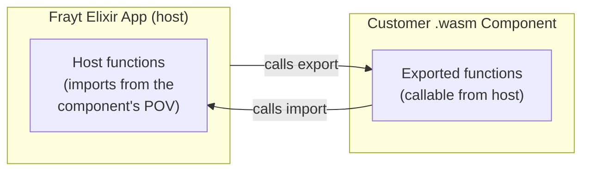
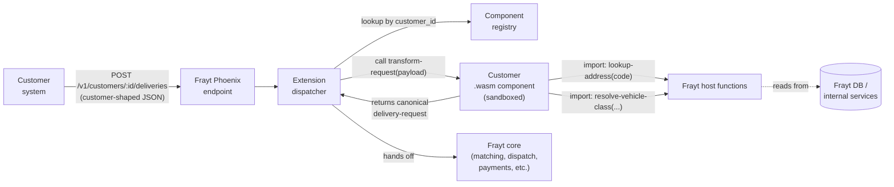
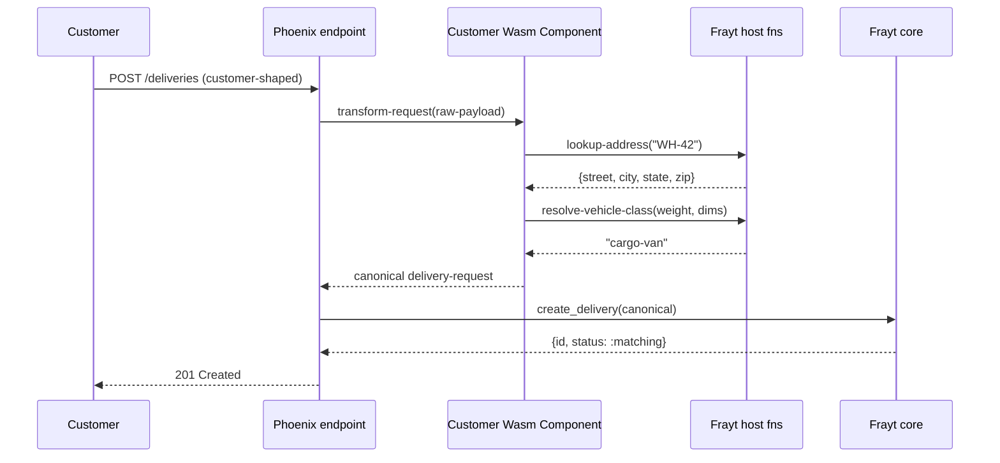
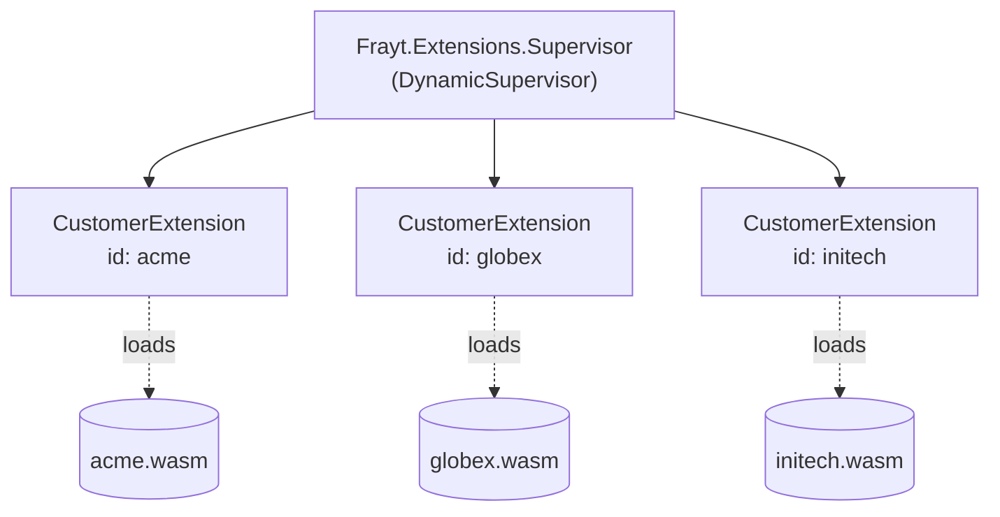
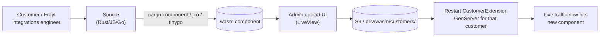

# Customer Extensions for Frayt via WebAssembly Components

## Summary

Frayt customers integrate with our delivery platform by sending package‑delivery
requests in their own data shapes. Today, supporting a new customer means we
either ask them to conform to Frayt's request schema or we write bespoke
transformation/integration code inside the platform — code that lives in our
release cycle, our deploys, and our on‑call rotation.

This document proposes a model where each customer gets a **sandboxed extension
point**, implemented as a [WebAssembly Component](https://component-model.bytecodealliance.org/),
that runs inside the Frayt Elixir application using
[wasmex](https://hexdocs.pm/wasmex/). The extension is responsible for two
things:

1. **Transforming** the customer's incoming payload into Frayt's canonical
   delivery‑request structure.
2. **Calling back** into a small, well‑defined set of Frayt host functions
   (e.g. address lookup, vehicle‑class resolution, posting the canonical
   request) when transformation alone isn't enough.

A working proof of concept already exists in this repository
([`wasm_commerce`](../README.md)) — a fake e‑commerce app whose shipping cost is
computed by a WebAssembly component. The same pattern transfers directly to
Frayt; only the WIT world and the host imports change.

---

## Why WebAssembly Components (and not just a webhook / DSL / plug‑in jar)

| Concern | Webhook to customer | Embedded scripting DSL | **Wasm Component** |
| --- | --- | --- | --- |
| Latency | Round‑trip over public internet | In‑process | **In‑process** |
| Sandboxing / blast radius | N/A (their infra) | Easy to escape, hard to harden | **Capability‑based, deny‑by‑default** |
| Language choice for customer | Anything | One (ours) | **Rust, JS/TS, Go, Python, C#, …** |
| Typed contract | OpenAPI on both sides | None usually | **WIT — typed at compile and load time** |
| Hot deploy of customer code | Their problem | Risky | **Upload `.wasm`, restart one GenServer** |
| Cost when idle | None | None | **None — instances are cheap to start/stop** |

The Component Model is the piece that makes this practical: it gives us a
typed, language‑agnostic ABI on top of core WebAssembly, so a customer can ship
us a `.wasm` file built from whatever language they like and we can call into
it with proper records, lists, and strings — no manual memory marshalling.

---

## How the Component Model fits

A WebAssembly **component** is described by a [WIT (Wasm Interface Types)](https://component-model.bytecodealliance.org/design/wit.html)
file. The WIT names the **world** the component lives in — its imports
(host‑provided functions it can call) and its exports (functions the host can
call on it).



The contract is symmetric: imports and exports are both just typed function
signatures in WIT. The host can hand the component a closed set of capabilities
(only the imports we declare), and the component cannot reach anywhere we
didn't permit — no filesystem, no network, no syscalls — unless we wire those
up explicitly via [WASI](https://wasi.dev/).

### The example in this repo

Look at [`wasm/shipping-calculator.wit`](../wasm/shipping-calculator.wit):

```wit
package wasm:commerce;

world shipping-calculator-component {
  import product-surcharge: func(product: product) -> u32;
  export calculate-shipping: func(order: order) -> u32;

  record order { ... }
  record customer { ... }
  record line-item { ... }
  record product { ... }
}
```

The Elixir host implements `product-surcharge` and *calls* `calculate-shipping`
on each order. See [`shipping_calculator.ex`](../lib/wasm_commerce/orders/shipping_calculator.ex):

```elixir
defmodule WasmCommerce.Orders.ShippingCalculator do
  use Wasmex.Components.ComponentServer,
    wit: "wasm/shipping-calculator.wit",
    imports: %{
      "product-surcharge" => {:fn, &get_product_surcharge/1}
    }

  def calculate_shipping(order), do: calculate_shipping(__MODULE__, order)
  def get_product_surcharge(%{name: name}), do: ...
end
```

The `.wasm` itself is built by `jco` from a tiny JS file
([`wasm/shipping-calculator.js`](../wasm/shipping-calculator.js)) — but a
customer could equally produce it from Rust, Go, or Python and we'd never know
the difference at runtime.

The `.wasm` binary is hot‑reloadable: the admin LiveView at
[`wasm_upload.ex`](../lib/wasm_commerce_web/live/admin_live/wasm_upload.ex)
accepts an upload, replaces the file, and restarts the supervised
`ShippingCalculator` GenServer. Same pattern works for Frayt customer
extensions.

---

## Applying it to Frayt

### The problem in concrete terms

A Frayt customer sends us "please deliver this package" requests. The shape
varies wildly:

- Customer A POSTs a flattened JSON with `pickup_zip`, `dropoff_zip`,
  `weight_lb`, `value_usd`.
- Customer B uses an EDI‑ish nested structure with `Shipment.Origin.PostalCode`.
- Customer C has multi‑stop manifests with their own SKU catalog and wants us
  to look up the recipient address from a code we don't know about.

Today, each of these turns into a custom controller, a schema mapper, and a
handful of edge‑case branches in shared code paths. We propose pushing that
per‑customer logic out of the Frayt codebase and into a `.wasm` artifact owned
by the customer (or by a Frayt integrations engineer working on their behalf).

### Architecture



### Sequence of one request



### Proposed WIT world (sketch)

The exact shapes need design with the Frayt domain team, but the skeleton:

```wit
package frayt:extension;

world customer-extension {

  // ----- Host functions the component may call -----

  /// Resolve a customer-internal location code to a real postal address.
  import lookup-address: func(code: string) -> result<address, lookup-error>;

  /// Pick the right vehicle tier for a payload.
  import resolve-vehicle-class: func(p: payload-dimensions) -> vehicle-class;

  /// Optional structured logging back to Frayt.
  import log: func(level: log-level, message: string);

  // ----- Functions the component must export -----

  /// Convert the customer's raw JSON body (as a string) into Frayt's
  /// canonical delivery request, or return a typed error.
  export transform-request:
    func(raw-json: string) -> result<delivery-request, transform-error>;

  /// Optional: convert Frayt status updates back into the customer's
  /// preferred shape (e.g. for outbound webhooks).
  export render-status-update:
    func(update: status-update) -> string;

  // ----- Shared records -----

  record address { street: string, city: string, state: string, zip: string }
  record payload-dimensions { weight-grams: u32, length-mm: u32,
                              width-mm: u32, height-mm: u32 }

  record delivery-request {
    pickup: address,
    dropoff: address,
    items: list<item>,
    vehicle-class: vehicle-class,
    customer-reference: string,
  }

  record item { description: string, quantity: u32,
                dims: payload-dimensions, declared-value-cents: u32 }

  enum vehicle-class { car, suv, cargo-van, box-truck }
  enum log-level { debug, info, warn, error }

  variant lookup-error { not-found, ambiguous(string) }
  variant transform-error { invalid-json(string), missing-field(string),
                            domain(string) }
}
```

Two things worth noting:

1. **Imports are the customer's only way to reach Frayt internals.** If
   `lookup-address` isn't in the world, the component physically cannot call
   it. This is the security model.
2. **Errors are first‑class (`result<T, E>`).** A misbehaving extension cannot
   throw an opaque exception that breaks the host; it returns a typed error,
   which the dispatcher can log, reject the request, and alert on.

### Elixir host wiring

The pattern is exactly what you see in
[`shipping_calculator.ex`](../lib/wasm_commerce/orders/shipping_calculator.ex)
and [`application.ex`](../lib/wasm_commerce/application.ex), generalised over
customer ID:

```elixir
defmodule Frayt.Extensions.CustomerExtension do
  use Wasmex.Components.ComponentServer,
    wit: "wasm/customer-extension.wit",
    imports: %{
      "lookup-address"        => {:fn, &Frayt.Hosts.lookup_address/1},
      "resolve-vehicle-class" => {:fn, &Frayt.Hosts.resolve_vehicle_class/1},
      "log"                   => {:fn, &Frayt.Hosts.log/2}
    }

  # exported funcs are auto-generated from the WIT
end
```

A `DynamicSupervisor` keyed by `customer_id` starts one
`CustomerExtension` GenServer per active customer, each loaded from
`priv/wasm/customers/<customer_id>.wasm`. New uploads replace the file and
restart that one child — no global deploy, no impact on other customers.



### Authoring & deployment flow



The upload + restart half of this is already implemented in
[`wasm_upload.ex`](../lib/wasm_commerce_web/live/admin_live/wasm_upload.ex);
turning it into a per‑customer flow is mostly plumbing.

---

## What we get

- **Isolation.** A bug in a customer extension cannot read other customers'
  data, exhaust the BEAM, or call out to the network unless we explicitly grant
  it. WASI capabilities are deny‑by‑default.
- **Independent deploy cadence.** Customer integrations no longer block on
  Frayt release windows. An extension change is a `.wasm` upload, not a PR
  against the platform.
- **Language freedom.** Customers integrate in the language their team already
  uses. Frayt only has to maintain the WIT contract and the host functions.
- **Versioning that doesn't fork the platform.** Two customers can be on two
  different versions of the WIT world simultaneously; the host loads each
  component against the WIT it was built for.
- **A typed contract, machine‑checked.** WIT is to Wasm what `.proto` is to
  gRPC, except the type system is richer (variants, results, options, lists,
  records) and there's no JSON in the middle.

## Tradeoffs and open questions

- **Latency budget.** A component invocation is microseconds, but each call
  back into a host import has overhead. We need to design the WIT so the
  common case is one export call with a small number of import callbacks, not
  a chatty back‑and‑forth.
- **Observability.** We need tracing across the host/guest boundary —
  presumably by threading a request ID through `log` and any other host
  imports.
- **Resource limits.** wasmtime (which wasmex wraps) supports fuel and memory
  limits. We should set conservative defaults per customer and tune.
- **Stateful imports.** The example here is pure transformation. If an
  extension needs to call something genuinely stateful (e.g. *create* a Frayt
  delivery rather than just shape one), we need to decide whether that lives
  as an import or whether we keep extensions pure and have the dispatcher do
  the side effect.
- **Schema evolution.** Adding a field to a WIT record is a breaking change
  for already‑compiled components. We need a versioning policy
  (`frayt:extension@1.2.0`) and a sunset window.

---

## References

### WebAssembly Component Model

- Component Model book (the canonical intro) — <https://component-model.bytecodealliance.org/>
- WIT language reference — <https://component-model.bytecodealliance.org/design/wit.html>
- Component Model on GitHub — <https://github.com/WebAssembly/component-model>
- WASI (the capability‑based system interface) — <https://wasi.dev/>
- WASI Preview 2 (what wasmex 0.12 targets) — <https://github.com/WebAssembly/WASI/blob/main/wasip2/README.md>

### Toolchains for producing components

- `cargo component` (Rust) — <https://github.com/bytecodealliance/cargo-component>
- `jco` (JavaScript/TypeScript, used in this repo) — <https://github.com/bytecodealliance/jco>
- `tinygo` component support — <https://tinygo.org/docs/guides/webassembly/>
- `componentize-py` (Python) — <https://github.com/bytecodealliance/componentize-py>

### Elixir / wasmex

- wasmex on Hex — <https://hex.pm/packages/wasmex>
- wasmex docs — <https://hexdocs.pm/wasmex/>
- `Wasmex.Components.ComponentServer` (the GenServer pattern this repo uses)
  — <https://hexdocs.pm/wasmex/Wasmex.Components.ComponentServer.html>
- wasmex source — <https://github.com/tessi/wasmex>

### Runtime under the hood

- wasmtime (the engine wasmex embeds) — <https://wasmtime.dev/>

### This repo (proof of concept)

- WIT contract: [`wasm/shipping-calculator.wit`](../wasm/shipping-calculator.wit)
- Guest implementation (JS): [`wasm/shipping-calculator.js`](../wasm/shipping-calculator.js)
- Build script: [`wasm/build.sh`](../wasm/build.sh)
- Host wrapper (Elixir): [`lib/wasm_commerce/orders/shipping_calculator.ex`](../lib/wasm_commerce/orders/shipping_calculator.ex)
- Supervision: [`lib/wasm_commerce/application.ex`](../lib/wasm_commerce/application.ex)
- Hot‑reload upload UI: [`lib/wasm_commerce_web/live/admin_live/wasm_upload.ex`](../lib/wasm_commerce_web/live/admin_live/wasm_upload.ex)
